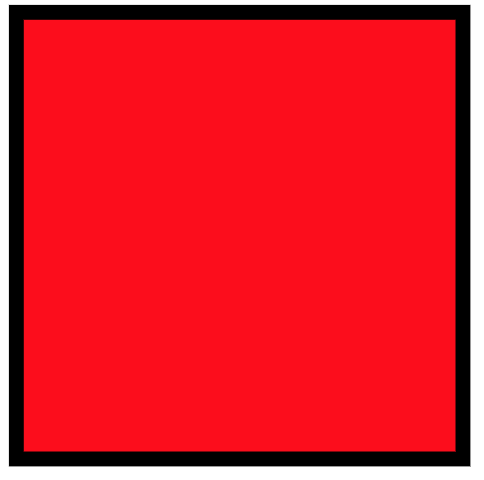
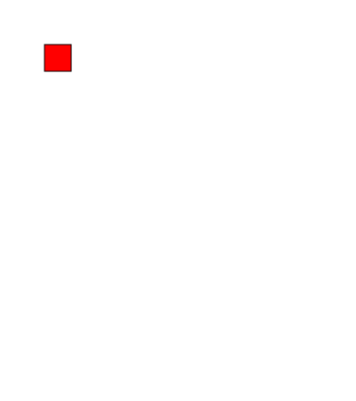

# Animate++

Animate++ is a C++ library that lets you rapidly compose beautiful vector graphics animation.

## Getting started

- To build the project


## Dependencies

- pugixml: `1.9`

## Examples

__Input SVG file__:
```xml
<svg width="400" height="400" version="1.1" xmlns="http://www.w3.org/2000/svg">
  <rect x="50" y="50" width="30" height="30" stroke="black" fill="red" stroke-width="1"/>
</svg>
```

<p align="center">
    
</p>

__Target program__: outputs a synoptically correct SVG file that yields to the same visual output
```cpp
#include <iostream>
#include <animatepp.h>
using namespace anipp;

int main() {
    Shape rect = svg.load("./sample.svg"); // load the xml file containing svg
    cout << rect.x << "\n"; // read its x
    cout << rect.width << "\n"; // read its width

    // rotate_center is a high-level function that
    // animates an objects by rotating it around the centroid
    // (exact arguments TBD)
    rect.animator.rotate_center();

    rect.export("./output.svg"); // save to output.xml file
}
```

__Exported SVG__: this is one of the frames. The resulting SVG will be the same square rotating with respect to its center indefinitely
```xml
<svg width="400" height="400" version="1.1" xmlns="http://www.w3.org/2000/svg">
  <rect x="50" y="50" width="30" height="30" stroke="black" fill="red" stroke-width="1">
      <animateTransform attributeName="transform"
          attributeType="XML"
          type="rotate"
          from="0 65 65"
          to="360 65 65"
          dur="4s"
          repeatCount="indefinite"/>
  </rect>
</svg>
```

<p align="center">
    
</p>
