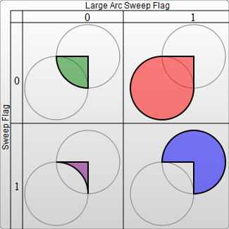

# Animate++: Complete Reference Manual

## 0. Table of Contents

<!-- TOC depthFrom:1 depthTo:6 withLinks:1 updateOnSave:1 orderedList:0 -->

- [Animate++: Complete Reference Manual](#animate-complete-reference-manual)
	- [0. Table of Contents](#0-table-of-contents)
	- [1. Overall](#1-overall)
	- [2. Background](#2-background)
	- [3. ChangeLog](#3-changelog)
	- [4. API Reference](#4-api-reference)
	- [Classes](#classes)
		- [Point](#point)
			- [print()](#print)
		- [Shape](#shape)
			- [1. Rectangle](#1-rectangle)
			- [2. Circle](#2-circle)
			- [3. Ellipse](#3-ellipse)
			- [4. Line](#4-line)
			- [5. Polyline](#5-polyline)
			- [6. Polygon](#6-polygon)
			- [7. Path](#7-path)
				- [moveTo()](#moveto)
				- [lineTo()](#lineto)
				- [quadraticCurveTo()](#quadraticcurveto)
				- [arcTo()](#arcto)
				- [cubicCurveTo()](#cubiccurveto)
		- [More functions for objects with any shape.](#more-functions-for-objects-with-any-shape)
			- [print()](#print)
			- [export_SVG()](#exportsvg)
			- [attr()](#attr)
			- [get_attributes()](#getattributes)
			- [print_attributes()](#printattributes)
			- [export_attributes()](#exportattributes)
			- [add_animations()](#addanimations)
			- [save()](#save)
		- [Complex shapes (How compound object has each component edited individually?)](#complex-shapes-how-compound-object-has-each-component-edited-individually)
		- [Animator](#animator)
			- [translate()](#translate)
			- [rotate()](#rotate)
			- [scale()](#scale)
			- [move_along()](#movealong)
			- [active()](#active)
			- [duration()](#duration)
			- [loop()](#loop)

<!-- /TOC -->

## 1. Overall
Animate++ is a light-weighted SVG processing library used in C++, which is in pursuit of standardized SVG formatting utilizing C++ features as well as easy-to-call API.

The functionalities of Animate++ are listed in below:
1. Loading and exporting SVG files.
2. Creating all fundamental shapes.
3. CRUD on shape attributes.
4. Basic animations including rotation, translation, scaling.
5. Allowing objects to move along a Bezier curve.

## 2. Background

- SVG
    - SVG stands for Scalable Vector Graphics.
    - Most used SVG libraries are all written in JS due to its tight relationship with front-end.
    - From our point of view, Object Oriented Design can largely improve the scalability and performance of a SVG library. Together with type checking and other C++ features, we find C++ a good match up for SVG manipulation and animation.
- SMIL
    - SMIL stands for XML based SVG files, the major strength of which is to store complicated SVG files together with animations. Nowadays, SMIL has been largely replaced by CSS based SVG files.
    - What charming about SMIL is its standalone feature, which is saying the whole SVG together with animation are all contained within the same file. This is not the case with CSS and Javascript, as CSS usually contains static components while Javascript is in charge of animations. Because of that, many digital artists are in favor of SMIL, and we want to save the standards of SVGs from the rampant SVG community.

With C++ and SMIL, we are about to make a change.

## 3. ChangeLog

- `0.5`
  - XML parsing under the support of pugi library
- `0.8`
  - SVG loader supports all common shapes individually including
      - Rectangle
      - Circle
      - Ellipse
      - Line
      - Polyline
      - Path
      - Bezier curve
  - Compound shape with any number of individual objects can also be loaded
  (a code snippet of how we load any type of shape is shown in below).
  ```cpp
  // load SVG
  ShapePtr g = load(in_path);
  // output the object to an SVG file
  g->save(out_path);
  ```
  - Valid SVG file can be generated.
  ```xml
  <?xml version="1.0"?>
  <svg version="1.1" xmlns="http://www.w3.org/2000/svg">
    <g>
      <rect x="10" y="10" rx="0" ry="0" width="30" height="30"
           fill="transparent" stroke="black" stroke-width="5" />
      <rect x="60" y="10" rx="10" ry="10" width="30" height="30"
           fill="transparent" stroke="black" stroke-width="5" />
      <circle cx="25" cy="75" r="20" fill="transparent" stroke="red"
           stroke-width="5" />
      <ellipse cx="75" cy="75" rx="20" ry="5" fill="transparent"
           stroke="red" stroke-width="5" />
      <line x1="10" y1="110" x2="50" y2="150" stroke="orange" stroke-width="5" />
      <polyline points="60 110 65 120 70 115 75 130 80 125 85 140 90 135 95
           150 100 145" fill="transparent" stroke="orange" stroke-width="5" />
      <polygon points="50 160 55 180 70 180 60 190 65 205 50 195 35 205 40
           190 30 180 45 180" fill="transparent" stroke="green" stroke-width="5" />
      <path d="M 20 230 Q 40 205 50 230 T 90 230 " fill="none" stroke="blue" stroke-width="5" />
    </g>
  </svg>
  ```
  - Basic animations including rotation, scaling and translation of all basic objects have been accomplished. Users are free to manipulate the existing objects in their ways of favor. (An example of how we edit our circle animation is shown by the c++ code snippet in below)

  Here is the SVG before editing
  ```xml
  <circle cx="100" cy="100" r="100" fill="yellow" opacity="0.5">
  </circle>
  ```
  Our code to modify animation
  ```cpp
  c.animate.translate(Point(100, 100), Point(0, 200), true)
           .duration("2.5s")
           .loop(true);
  ```
  The SVG after editing
  ```xml
  <circle cx="100" cy="100" r="100" fill="yellow" opacity="0.5">
      <animateTransform attributeName="transform"
           type="translate" dur="2.5s" from="100 100"
           repeatCount="indefinite" to="0 200" />
  </circle>
  ```

- `1.0`
  - Fonts, fills and strokes are all completed(shown in the code snippet in below)
  ```cpp
  Circle c(100, 100, 100);
  c.attr({
      {"fill", "yellow"},
      {"opacity", "0.5"}
  });
  ```
  - Gradients and patterns are special entities in SVG standards, which require building and referring to xml references. We have utilized it in our logo, but up to now there is no general support for these features.
  - Complicated animation has also been accomplished. In the example given below, we load a tiger SVG as a combination of more than 200 beizer curves with over 700 lines of code. The whole tiger head can rotate and translate.

  <p align="center">
      
  </p>

  - Path class completed. Can now modify all different kinds of paths including line, quadratic curve, bezier curve and arc.
- `1.2`
  - Motions along all different types of paths are available.

## 4. API Reference

## Classes

### Point
Point is constructed by two doubles, which is the essential class for our SVG library.
#### print()
Print a point object.
```cpp
Point p(1, 2);
print(p); // -> 1 2;
```
### Shape
Shape is an abstract class extended by the following shapes.
#### 1. Rectangle
- In SVG, rectangle is called using `<rect>`.
	Within the scope of `<rect>`, we need to define <span style="color:red"> 4 </span> major properties to at least make the shape valid: <span style="color:blue">
	x : x-coordinate of top left corner
	y : y-coordinate of top left corner
	width : width of rectangle
	height : height of rectangle
	</span>
- An example shown in below as:
	`<rect x="10" y="10" width="30" height="30"/>`
	Our c++ initialization is:
	```cpp
	Rect r(10, 10, 30, 30);
	```
#### 2. Circle
- In SVG, rectangle is called using `<circle>`.
	Within the scope of `<rect>`, we need to define <span style="color:red"> 3 </span> major properties to at least make the shape valid: <span style="color:blue">
	cx : center coordinate on x-axis
	cy : center coordinate on y-axis
	r : radius
	</span>
- An example shown in below as:
	`<circle cx="25" cy="75" r="20"/>`
	Our c++ initialization is:
	```cpp
	Circle c(25, 75, 20);
	```
#### 3. Ellipse
- In SVG, ellipse is called using `<ellipse>`.
	Within the scope of `<ellipse>`, we need to define <span style="color:red"> 4 </span> major properties to at least make the shape valid: <span style="color:blue">
	cx : center coordinate on x-axis
	cy : center coordinate on y-axis
	rx : radius on x-axis
	ry : radius on y-axis
	</span>
- An example shown in below as:
	`<ellipse cx="75" cy="75" rx="20" ry="5"/>`
	Our c++ initialization is:
	```cpp
	Ellipse e(75, 75, 20, 5);
	```
#### 4. Line
- In SVG, line is called using `<line>`.
	Within the scope of `<line>`, we need to define <span style="color:red"> 4 </span> major properties to at least make the shape valid: <span style="color:blue">
	x1 : starting x-axis coordinate
	x2 : ending x-axis coordinate
	y1 : starting y-axis coordinate
	y2 : ending y-axis coordinate
- An example shown in below as:</span>
	`<line x1="10" x2="50" y1="110" y2="150"/>`
	Our c++ initialization is:
	```cpp
	Line l(10, 50, 110, 150);
	```
#### 5. Polyline
- In SVG, polyline is called using `<polyline>`.
	Within the scope of `<polyline>`, we need to define a list of points, simply an array of pairs of numbers.
- An example shown in below as:
	`<polyline points="60 110 65 120"/>`
	Our c++ initialization is:
	```cpp
	Vector<Point> vec(Point(60, 110), Point(65, 120));
	Polyline p(vec);
	```
#### 6. Polygon
- In SVG, polygon is called using `<polygon>`.
	Within the scope of `<polygon>`, we need to define a list of points, simply an array of pairs of numbers.
- An example shown in below as:
	`<polygon points="50 160 55 180"/>`
	Our c++ initialization is:
	```cpp
	Vector<Point> vec(Point(50, 160), Point(55, 180));
	Polygon p(vec);
	```
#### 7. Path
- In SVG, path is called using `<path>`.
	Path, which essentially is a bezier curve, is the most complicated shape among all SVG basic shapes, but it is what makes SVG charming. There can be a large number of types of input bezier curve and they end up to be all valid. Due to the large number of samples covered, we will not enumerate all of them in the following. Our parser has covered most of the valid bezier curves. Any valid form of bezier curve can be taken as a string input to our constructor.
- An example shown in below as:
	`<path d="M20,230 Q40,205 50,230 T90,230"/>`
	Our c++ initialization is:
	```cpp
	string d="M20,230 Q40,205 50,230 T90,230";
	Path p(d);
	```
- There are some more useful functions to edit our path.
##### moveTo()
- move the path to a certain position without drawing.
- Taking three parameters in sequence.
  - double: x (destination position on x-axis)
  - double: y (destination position on y-axis)
  - bool: relative (whether move in relative form or absolute form)
```cpp
p.moveTo(x, y, relative);
```
##### lineTo()
- move the path to a certain position drawing a straight line.
- Taking three parameters in sequence.
  - double: x (destination position on x-axis)
  - double: y (destination position on y-axis)
  - bool: relative (whether move in relative form or absolute form)
```cpp
p.lineTo(x, y, relative);
```
##### quadraticCurveTo()
- move the path to a position following a quadratic curve.
- Taking five parameters in sequence.
  - double: cpx (control point position on x-axis)
  - double: cpy (control point position on y-axis)
    -  for more information about control points, <a href="https://math.stackexchange.com/questions/2388032/finding-the-control-points-of-a-quadratic-b%C3%A9zier-curve">click here</a>
  - double: x (destination position on x-axis)
  - double: y (destination position on y-axis)
  - bool: relative (whether move in relative form or absolute form)
```cpp
p.quadraticCurveTo(cpx, cpy, x, y, relative);
```
##### arcTo()
- move the path to a position following a arc, which can be treated as a smoother curve.
bool relative
- Taking eight parameters in sequence.
  - double: rx (radius on x-axis)
  - double: ry (radius on y-axis)
  - double: x_axis_rotation (how much is the angle tilted)
  - double: large_arc_flag
  - double: sweep_flag
  - double: x (destination position on x-axis)
  - double: y (destination position on y-axis)
  - bool: relative (whether move in relative form or absolute form)
  The image in below explains what's <span style="color:red">large_arc_flag</span> and what's <span style="color:red">sweep_flag</span>

```cpp
p.arcTo(rx, ry, x_axis_rotation, large_arc_flag, sweep_flag, x, y, relative);
```
##### cubicCurveTo()
Also known as bezier curve, which is the real soul of SVG!
- Taking seven parameters in sequence.
  - double: cp1x (control point 1 on x-axis)
  - double: cp1y (control point 1 on y-axis)
  - double: cp2x (control point 2 on x-axis)
  - double: cp2y (control point 2 on y-axis)
  - double: x (destination position on x-axis)
  - double: y (destination position on y-axis)
  - bool: relative (whether move in relative form or absolute form)
```cpp
p.cubicCurveTo(cp1x, cp1y, cp2x, cp2y, x, y, relative);
```
  Here are a few examples shown in below:
  ```cpp
  Path p;
  p.moveTo(10, 110)
   .arcTo(120, 120, -45, 0, 1, 110, 10)
   .arcTo(120, 120, -45, 0, 1, 10,  110);
  ```


### More functions for objects with any shape.

#### print()
Print any shape object.
```cpp
Rectangle r(30, 30, 20, 20);
print(r); // -> x=30, y=30, width=20, height=20
```
#### export_SVG()
Write the object to a SVG file.
```cpp
Rectangle r(30, 30, 20, 20);
auto node = r.export_SVG(doc); // aggregate code in doc and output it as a node
```
What we have just created is a node object. To save our modification into a file, we will do the following.
```cpp
out_path = "<some user defined directory>";
xml_document doc; // create an xml_document object
auto svg = SVG_header(doc); // create svg node in doc object
Rectangle r(30, 30, 20, 20);
auto node = r.export_SVG(doc);
svg.append_move(node); // append our node to the svg
doc.save_file(out_path.c_str()); // save the xml_document to the path
```
#### attr()
User can either add a single pair of attributes to the shape object or add multiple pairs of attributes inside a <span style="color:red">map</span> all into the object.
```cpp
Rect r(0, 0, 100, 100, 3, 3);
// add a pair of attribute.
r.attr("fill", "blue");
// add two pairs.
r.attr({
    {"stroke", "black"},
    {"stroke-width", "5"}
});
// we update fill color to yellow.
r.attr("fill", "yellow");
// we delete stroke attribute
r.attr("stroke", "");
```

#### get_attributes()
Return a list of attributes contained by certain shape
```cpp
r.attr({
    {"fill", "blue"},
    {"stroke", "black"},
    {"stroke-width", "5"}
});
auto map = r.get_attributes();
// map ->
// {{"fill", "blue"},
//  {"stroke", "black"},
//  {"stroke-width", "5"}}
```
#### print_attributes()
Print all attributes contained within a Shape object.
```cpp
r.attr({
    {"fill", "blue"},
    {"stroke", "black"},
    {"stroke-width", "5"}
});
r.print_attributes();
// {{"fill", "blue"},
//  {"stroke", "black"},
//  {"stroke-width", "5"}}
```
#### export_attributes()
Export all attributes to an xml_node
```cpp
xml_document doc;
xml_node node = SVG_header(doc);
// Attributes inside the rectangle r are exported to node.
r.export_attributes(node);
```
#### add_animations()
Add animations to given node.
```cpp
Rectangle r(0, 0, 100, 100);
r.add_animations(pugi::xml_document&, pugi::xml_node);
```

#### save()
Save the Shape to the given path
```cpp
Rectangle r(0, 0, 100, 100);
string path = "rectangle.svg";
r.save(path);
```
### Complex shapes (How compound object has each component edited individually?)
Of course, supporting only single type of object is not sufficient to accomplish all fancy functionalities that can potentially be achieved by SVGs. Animate++ also supports multiple shapes contained in one single file to be loaded all together.
```cpp
// load in svg from a path, which is a string of local file directory
ShapePtr g = load(in_path);
// output the object to an SVG file
g->save(out_path);
```

### Animator
Each shape has an animator called <span style="color:red">animate</span> attached to it, which is in charge of the animation.

#### translate()
In translation, user needs to define the initial and ending position on x and y axis. An example of translation is shown in below, from "100 100" to "0 200" entails that the object transforms from (100, 100) to (0, 200).
```cpp
c = circle(25, 75, 20);
c.animate.translate(Point(100, 100), Point(0,200));
```
Or instead, given the amount an object is translated from current position instead of its destination, which we referred to as relative translation. An example is shown in below.
```cpp
c = circle(25, 75, 20);
c.animate.translate(Point(100, 100), Point(0, 200), true);
```

#### rotate()
In rotation, the from and to are in the form "n1 n2 n3", where "n1" entails the degree of rotation, and (n2, n3) indicates the center position of rotation. As what has been shown in below, rotation takes place from 0 to 360 degrees around the center (100, 100).
```cpp
Point center_begin(100, 100);
Point center_end(200, 200);
r.animate.rotate(center_begin, 0, center_end, 360);
```

#### scale()
In scaling, the initial and ending scaling on x and y axis are both required.
```cpp
r.animate.scale(Point(0, 0), Point(1, 1)); // the object's scale transforms from (0*x, 0*y) to (1*x, 1*y)
```

#### move_along()
Let the animator taking a path input, which will add an animateMotion to the object and have the object moving down the path.
```cpp
Path p;
p.moveTo(10, 110)
 .arcTo(120, 120, -45, 0, 1, 110, 10)
 .arcTo(120, 120, -45, 0, 1, 10,  110);
r.animate.move_along(p);
```
```cpp
// Define path that we will travel.
// For more information on path definition, refer to previous part on Path.
Path p;
p.moveTo(10, 110)
 .arcTo(120, 120, -45, 0, 1, 110, 10)
 .arcTo(120, 120, -45, 0, 1, 10,  110);
p.attr({
    {"stroke", "lightgrey"},
    {"stroke-width", "2"},
    {"fill", "none"},
});
// Create end point 1 on bottom left corner
Circle end_point1(10, 110, 3);
end_point1.attr("fill", "lightgrey");
// Create end point 2 on top right corner
Circle end_point2(110, 10, 3);
end_point2.attr("fill", "lightgrey");
// Create our red ball moving along the path
Circle ball(0, 0, 5);
ball.attr("fill", "red");
ball.animate.move_along(p)
            .duration("6s")
            .loop(true);

Group g(p, end_point1, end_point2, ball);
g.save(out_path);
```


#### active()
Check whether given object has any animation with it.
```cpp
c.animate.active() // return true if c contains any animation.
```

#### duration()
Return void
Set the duration for the animation.
```cpp
c.animate.duration("2.5s"); // set animation duration to 2.5 seconds.
```
#### loop()
Provide a boolean value determine the state of animation.
```cpp
c.animate.loop(true); // c will keep on animating.
```
