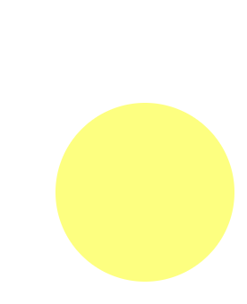

# Animate++ Evaluation Metrics

__Wode "Nimo" Ni - wn2155@columbia.edu__
__Xuanyuan Zhang - xz2580@columbia.edu__

## Test suite
(Because animation is not supported on pdf, for detailed testing results, please refer to `test/src/test.cpp` file in our source folder to read the code and `test/svgs`, `test/output` for detailed comparisons)
__These are selected test results, each representing some specific functionalities we want to achieve. These 5 test cases in the following are sufficient to prove the correctness of our project.__

### Testing on static file loading and export.

-  Testing on three major functionalities:
    1. Loading and exporting all basic shapes.
    2. Testing on their attributes.
    3. Loading and exporting compound shape.

```cpp
void test_group(string in_path, string out_path) {
  ShapePtr g = load(in_path);
  g->save(out_path);
}
```
```cpp
test_group("test/svgs/sample.svg",
         "test/output/sample_out.svg");
```
A screen shot of the svg is:
  

### Testing on translation

- Absolute translation. Real transformation is from (100, 100) to (200, 0)

```cpp
#define OUTPUT(s) out_dir + "/" + s

void test_ani_translate_abs(string out_path) {
    Circle c(100, 100, 100);
    c.attr({
        {"fill", "yellow"},
        {"opacity", "0.5"}
    });
    c.animate.translate(Point(100, 100), Point(0, 200))
             .duration("2.5s")
             .loop(true);
    c.save(out_path);
}
```
```cpp
test_ani_translate_abs(OUTPUT("circle_translate_abs.svg"));
```

<br>

- Relative translation. Real transformation is from (100, 100) to (300, 100)
```cpp
#define OUTPUT(s) out_dir + "/" + s

void test_ani_translate_rel(string out_path) {
    Circle c(100, 100, 100);
    c.attr({
        {"fill", "yellow"},
        {"opacity", "0.5"}
    });
    c.animate.translate(Point(100, 100), Point(0, 200), true)
             .duration("2.5s")
             .loop(true);
    c.save(out_path);
}
```
```cpp
test_ani_translate_rel(OUTPUT("circle_translate_rel.svg"));
```


### Testing on rotation

- Rotation centered at (20, 20). Complete 360 degrees of rotation in 10 seconds.

```cpp
#define OUTPUT(s) out_dir + "/" + s

void test_ani_rotate(string out_path) {
    Rect r(20, 20, 100, 100, 3, 3);
    r.attr({
        {"fill", "red"},
        {"stroke", "black"},
        {"stroke-width", "5"}
    });
    Point center(100, 100);
    r.animate.rotate(center, 0, center, 360)
             .duration("10s")
             .loop(true);
    r.save(out_path);
}
```

```cpp
test_ani_rotate(OUTPUT("rect_rotate.svg"));
```


### Testing on scaling

- Scaling of the sphere from (0, 0) to (1, 1), basically zooming in from infinitely small to be right at its size.

```cpp
#define OUTPUT(s) out_dir + "/" + s

void test_ani_scale(string out_path) {
    Circle c(100, 100, 100);
    c.attr({
        {"fill", "aqua"},
        {"opacity", "0.5"}
    });
    c.animate.scale(Point(0, 0), Point(1, 1))
             .duration("2.5s")
             .loop(true);
    c.save(out_path);
}
```

```cpp
test_ani_scale(OUTPUT("circle_scale.svg"));
```


### Testing on traveling along arbitrary paths

```cpp
#define OUTPUT(s) out_dir + "/" + s

void test_motion(string out_path) {
    Path p;
    p.moveTo(10, 110)
     .arcTo(120, 120, -45, 0, 1, 110, 10)
     .arcTo(120, 120, -45, 0, 1, 10,  110);
    p.attr({
        {"stroke", "lightgrey"},
        {"stroke-width", "2"},
        {"fill", "none"},
    });
    Circle end_point1(10, 110, 3);
    end_point1.attr("fill", "lightgrey");
    Circle end_point2(110, 10, 3);
    end_point2.attr("fill", "lightgrey");
    Circle ball(0, 0, 5);
    ball.attr("fill", "red");
    ball.animate.move_along(p)
                .duration("6s")
                .loop(true);

    Group g(p, end_point1, end_point2, ball);
    g.save(out_path);
}
```

```cpp
test_motion(OUTPUT("bezier_motion.svg"));
```


## memory management

- There is not much usage of dynamic memory allocations. A few use cases are listed in below:
  1. When we call get_shape function, we take input from an arbitrary node and try to get its shape. Here we dynamically allocates the object and using ShapePtr to point to it and return a ShapePtr as the output of the function. ShapePtr is nothing special but a shared_ptr. We made this design choice because of a lack of knowledge of the input type. Therefore, we made an abstract type pointer to store the value and by the time it is out of scope somewhere, it is automatically eliminated, causing no memory leak.

  ```cpp
  ShapePtr get_shape(pugi::xml_node node);
  ```

  2. Similar methodology as what we did on bullet 1 is also implemented here when we call load function, loading from any arbitrary file in the local directory given its path. This is due to the same reason, as we have no clue on what exact shape will we encounter. We use a shared_ptr in this way.

  ```cpp
  // Load from an SVG file
  ShapePtr load(std::string);
  ```

  3. To store the list of attributes for each shape, both default attributes and external attributes, we utilize map from c++ standard library, which preventing us from encountering memory arrangement.

  ```cpp
  typedef std::map<std::string, std::string> Attributes;
  ```

## Performance
The performance will be evaluated from different perspectives.
  - Functionalities supported by our application.
    1. Loading and exporting SVG files.
    2. Creating all fundamental shapes.
    3. CRUD on shape attributes.
    4. Basic animations including rotation, translation, scaling.
    5. Allowing objects to move along a Bezier curve.
  - Speed.
    Usually what we will evaluate on performance is by testing on the running speed. Here is our outcome.
    - The time it takes to load and export the tiger SVG, which contains over 700 bezier curves, is 0.1413 second.
    - However, there is no comparison we can make, for there is no such C++ application doing the same task. Regarding JS libraries, we find it unfair to compete against them because JS is not capable of loading directly from local disk. Passing the file through the network socket can potentially be the bottleneck of runtime speed of JS library. Therefore, we decide not to put the speed in concern, for the performance on C++ is satisfiable enough to process large scale SVG files.
