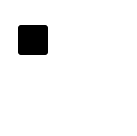
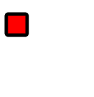
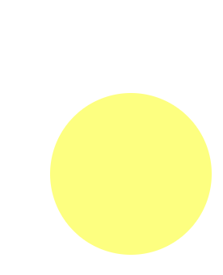
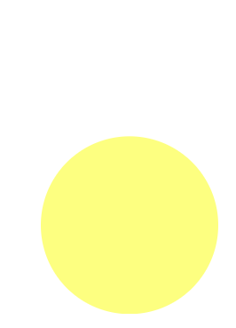
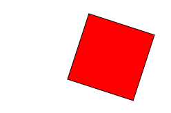
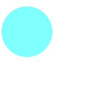

# Getting started: a tutorial to Animate++

__Wode "Nimo" Ni - wn2155@columbia.edu__
__Xuanyuan Zhang - xz2580@columbia.edu__

## Installation
### Download required libraries
- [boost](https://www.boost.org/) is utilized in our project. To download boost, simply run
	brew install boost on MacOS or download boost from the [given URL](https://www.boost.org/users/history/version_1_66_0.html) if you are Windows or Linux user.
- [pugi](https://pugixml.org/) is the xml parser which supports all parsing tasks, helping us extract content from SVG files. Tutorial on downloading pugi can be followed through [this link](https://pugixml.org/). After library being downloaded, put the whole unzipped file under the same directory as the code files, and you are ready to go.

## Basic shapes
### 1. Rectangle
- In SVG, rectangle is called using `<rect>`.
	Within the scope of `<rect>`, we need to define <span style="color:red"> 4 </span> major properties to at least make the shape valid: <span style="color:blue">
	x : x-coordinate of top left corner
	y : y-coordinate of top left corner
	width : width of rectangle
	height : height of rectangle
	</span>
- An example shown in below as:
	`<rect x="10" y="10" width="30" height="30"/>`
	Our c++ initialization is:
	```cpp
	Rect r(10, 10, 30, 30);
	```
### 2. Circle
- In SVG, rectangle is called using `<circle>`.
	Within the scope of `<rect>`, we need to define <span style="color:red"> 3 </span> major properties to at least make the shape valid: <span style="color:blue">
	cx : center coordinate on x-axis
	cy : center coordinate on y-axis
	r : radius
	</span>
- An example shown in below as:
	`<circle cx="25" cy="75" r="20"/>`
	Our c++ initialization is:
	```cpp
	Circle c(25, 75, 20);
	```
### 3. Ellipse
- In SVG, ellipse is called using `<ellipse>`.
	Within the scope of `<ellipse>`, we need to define <span style="color:red"> 4 </span> major properties to at least make the shape valid: <span style="color:blue">
	cx : center coordinate on x-axis
	cy : center coordinate on y-axis
	rx : radius on x-axis
	ry : radius on y-axis
	</span>
- An example shown in below as:
	`<ellipse cx="75" cy="75" rx="20" ry="5"/>`
	Our c++ initialization is:
	```cpp
	Ellipse e(75, 75, 20, 5);
	```
### 4. Line
- In SVG, line is called using `<line>`.
	Within the scope of `<line>`, we need to define <span style="color:red"> 4 </span> major properties to at least make the shape valid: <span style="color:blue">
	x1 : starting x-axis coordinate
	x2 : ending x-axis coordinate
	y1 : starting y-axis coordinate
	y2 : ending y-axis coordinate
- An example shown in below as:</span>
	`<line x1="10" x2="50" y1="110" y2="150"/>`
	Our c++ initialization is:
	```cpp
	Line l(10, 50, 110, 150);
	```
### 5. Polyline
- In SVG, polyline is called using `<polyline>`.
	Within the scope of `<polyline>`, we need to define a list of points, simply an array of pairs of numbers.
- An example shown in below as:
	`<polyline points="60 110 65 120"/>`
	Our c++ initialization is:
	```cpp
	Vector<Point> vec(Point(60, 110), Point(65, 120));
	Polyline p(vec);
	```
### 6. Polygon
- In SVG, polygon is called using `<polygon>`.
	Within the scope of `<polygon>`, we need to define a list of points, simply an array of pairs of numbers.
- An example shown in below as:
	`<polygon points="50 160 55 180"/>`
	Our c++ initialization is:
	```cpp
	Vector<Point> vec(Point(50, 160), Point(55, 180));
	Polygon p(vec);
	```
### 7. Path
- In SVG, path is called using `<path>`.
	Path, which essentially is a bezier curve, is the most complicated shape among all SVG basic shapes, but it is what makes SVG charming. There can be a large number of types of input bezier curve and they end up to be all valid. Due to the large number of samples covered, we will not enumerate all of them in the following. Our parser has covered most of the valid bezier curves. Any valid form of bezier curve can be taken as a string input to our constructor.
- An example shown in below as:
	`<path d="M20,230 Q40,205 50,230 T90,230"/>`
	Our c++ initialization is:
	```cpp
	string d="M20,230 Q40,205 50,230 T90,230";
	Path p(d);
	```
- There are some more useful functions to edit our path.
##### moveTo()
- move the path to a certain position without drawing.
- Taking three parameters in sequence.
  - double: x (destination position on x-axis)
  - double: y (destination position on y-axis)
  - bool: relative (whether move in relative form or absolute form)
```cpp
p.moveTo(x, y, relative);
```
##### lineTo()
- move the path to a certain position drawing a straight line.
- Taking three parameters in sequence.
  - double: x (destination position on x-axis)
  - double: y (destination position on y-axis)
  - bool: relative (whether move in relative form or absolute form)
```cpp
p.lineTo(x, y, relative);
```
##### quadraticCurveTo()
- move the path to a position following a quadratic curve.
- Taking five parameters in sequence.
  - double: cpx (control point position on x-axis)
  - double: cpy (control point position on y-axis)
    -  for more information about control points, <a href="https://math.stackexchange.com/questions/2388032/finding-the-control-points-of-a-quadratic-b%C3%A9zier-curve">click here</a>
  - double: x (destination position on x-axis)
  - double: y (destination position on y-axis)
  - bool: relative (whether move in relative form or absolute form)
```cpp
p.quadraticCurveTo(cpx, cpy, x, y, relative);
```
##### arcTo()
- move the path to a position following a arc, which can be treated as a smoother curve.
bool relative
- Taking eight parameters in sequence.
  - double: rx (radius on x-axis)
  - double: ry (radius on y-axis)
  - double: x_axis_rotation (how much is the angle tilted)
  - double: large_arc_flag
  - double: sweep_flag
  - double: x (destination position on x-axis)
  - double: y (destination position on y-axis)
  - bool: relative (whether move in relative form or absolute form)
  The image in below explains what's <span style="color:red">large_arc_flag</span> and what's <span style="color:red">sweep_flag</span>

```cpp
p.arcTo(rx, ry, x_axis_rotation, large_arc_flag, sweep_flag, x, y, relative);
```
##### cubicCurveTo()
Also known as bezier curve, which is the real soul of SVG!
- Taking seven parameters in sequence.
  - double: cp1x (control point 1 on x-axis)
  - double: cp1y (control point 1 on y-axis)
  - double: cp2x (control point 2 on x-axis)
  - double: cp2y (control point 2 on y-axis)
  - double: x (destination position on x-axis)
  - double: y (destination position on y-axis)
  - bool: relative (whether move in relative form or absolute form)
```cpp
p.cubicCurveTo(cp1x, cp1y, cp2x, cp2y, x, y, relative);
```

## Set external properties
Other than basic properties of each shape, there are more external properties, including color, stroke, etc. Animate++ supports easy ways for users to add properties.
The general way to set attribute is:
```cpp
r.attr(string name, string value);
```
Given an example in below.
Before we set up stroke, fill and stroke-width:

`<rect x="10" y="10" width="30" height="30" stroke="black" fill="transparent" stroke-width="5"/>`
This is a rectangle with three external properties, stroke, fill and stroke-width.
```cpp
r.attr({
		{"stroke", "black"},
		{"fill", "red"},
		{"stroke-width", "5"},
});
```
After setting up attributes, that's how it looks like.

We can simply modify the attributes to overwrite existing ones. For example:
```cpp
r.attr({
		{"stroke", "black"},
		{"fill", "red"}
});
// now we reset fill color to yellow.
r.attr("fill", "yellow");
// Using same logic, we can delete existing attribute simply by setting it to empty string
r.attr("stroke", "");
```
## Complex shapes
Of course, supporting only single type of object is not sufficient to accomplish all fancy functionalities that can potentially be achieved by SVGs. Animate++ also supports multiple shapes contained in one single file to be loaded all together.
```cpp
// load in svg from a path, which is a string of local file directory
ShapePtr g = load(in_path);
// output the object to an SVG file
g->save(out_path);
```

## Input and Output

### Load directly from external SVGs
Other than creating users' own objects, one can simply load the object given relative path of the svg file, creating a <span style="color:purple">ShapePtr</span> object, which is simply a pointer to a Shape object.
```cpp
string in_path = "sample.svg";
ShapePtr g = load(in_path);
```
Users can export the file simply by specifying the output directory, call <span style="color:blue">save</span> function.
```cpp
string out_path = "output.svg";
g -> save(out_path);
```

## Animation
In SVGs, objects can have animations, which are defined in the tag `<animateTransform>`.
Animate++ also supports animation editing. Each shape object has an <span style="color:purple">animator</span> named <span style="color:blue">animate</span>. When user wants to edit the animation, simply call the [object_name].animate.[function] to set up the animation. Here are examples in detail.
### Translation
In translation, user needs to define the initial and ending position on x and y axis. An example of translation is shown in below, from "100 100" to "0 200" entails that the object transforms from (100, 100) to (0, 200).
`<animateTransform attributeName="transform" type="translate" dur="2.5s" from="100 100" repeatCount="indefinite" to="0 200" />`
And that's how we use animate++ to rewrite the translation.
```cpp
c.animate.translate(Point(100, 100), Point(0, 200))
	 .duration("2.5s")
	 .loop(true);
```


Or instead, given the amount an object is translated from current position instead of its destination using keyword <span style="color:red">by</span>, which we referred to as relative translation. An example is shown in below.
`<animateTransform attributeName="transform" type="translate" by="0 200" dur="2.5s" from="100 100" repeatCount="indefinite" />`
This is also simple to achieve in animate++, for we only give a true boolean value as the third argument taken by translate function, which is by default false.
```cpp
c.animate.translate(Point(100, 100), Point(0, 200), true)
	 .duration("2.5s")
	 .loop(true);
```

### Rotation
In rotation, the from and to are in the form "n1 n2 n3", where "n1" entails the degree of rotation, and (n2, n3) indicates the center position of rotation. An example shown in below.
`		<animateTransform attributeName="transform" type="rotate" dur="10s" from="0 100 100" repeatCount="indefinite" to="360 100 100" />
`
That's how animate++ implements such rotation.
```cpp
Point center(100, 100);
r.animate.rotate(center, 0, center, 360)
	 .duration("10s")
	 .loop(true);
```

### Scaling
In scaling, the initial and ending scaling on x and y axis are both required. An example of scaling animation in SVG is shown in below, from "0 0" to "1 1" entails that the object's scale transforms from (0*x, 0*y) to (1*x, 1*y).
`		<animateTransform attributeName="transform" type="scale" dur="2.5s" from="0 0" repeatCount="indefinite" to="1 1" />`
And that's how we use animate++ to rewrite the scaling.
```cpp
c.animate.scale(Point(0, 0), Point(1, 1)) // from="0 0" to="1 1"
	 .duration("2.5s") // dur="2.5s"
	 .loop(true); // repeatCount="indefinite"
```

### Move_along
In move_along, user asks the animate object of any shape to take an input from a Path object. The object will then have a motion along the path being created. An example in below shows how we can generate complicated SVG file using straightforward c++ code:

SVG file that generated from our c++ code.

`<?xml version="1.0"?>
<svg version="1.1" xmlns="http://www.w3.org/2000/svg" xmlns:xlink="http://www.w3.org/1999/xlink">
<g id="group_1805">
	<path d="M 10 110 A 120 120 -45 0 1 110 10 A 120 120 -45 0 1 10 110 " fill="none" stroke="lightgrey" stroke-width="2" id="path_1801" />
	<circle cx="10" cy="110" r="3" fill="lightgrey" id="circle_1802" />
	<circle cx="110" cy="10" r="3" fill="lightgrey" id="circle_1803" />
	<circle cx="0" cy="0" r="5" fill="red" id="circle_1804">
		<animateMotion dur="6s" repeatCount="indefinite">
			<mpath xlink:href="#path_1801" />
		</animateMotion>
	</circle>
</g>
</svg>`

Our cpp code that generates the SVG above.

```cpp
// Define path that we will travel.
Path p;
p.moveTo(10, 110)
 .arcTo(120, 120, -45, 0, 1, 110, 10)
 .arcTo(120, 120, -45, 0, 1, 10,  110);
p.attr({
    {"stroke", "lightgrey"},
    {"stroke-width", "2"},
    {"fill", "none"},
});
// Create end point 1 on bottom left corner
Circle end_point1(10, 110, 3);
end_point1.attr("fill", "lightgrey");
// Create end point 2 on top right corner
Circle end_point2(110, 10, 3);
end_point2.attr("fill", "lightgrey");
// Create our red ball moving along the path
Circle ball(0, 0, 5);
ball.attr("fill", "red");
ball.animate.move_along(p)
            .duration("6s")
            .loop(true);

Group g(p, end_point1, end_point2, ball);
g.save(out_path);
```

Here comes the result.

