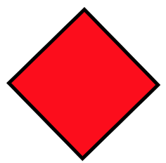

# Animate++ Progress Report

__Wode "Nimo" Ni - wn2155@columbia.edu__
__Xuanyuan Zhang - xz2580@columbia.edu__


## Introduction

In this progress report, we describes the following

- First milestone of the project and challenges faced so far
- An outline of the features for versions `0.8`, `1.0`, and `1.2`

## First milestone

Our first milestone will be to successfully load SVG file into our own data structure for editing and restore it back to another SVG file that can be interpreted by any web browser.

An mock program of our system after the completion of the first milestone:

__Input SVG file__:
```xml
<svg width="200" height="250" version="1.1" xmlns="http://www.w3.org/2000/svg">
  <rect x="50" y="50" width="30" height="30" stroke="black" fill="red" stroke-width="1"/>
</svg>
```

<p align="center">
    
</p>

__Target program__: outputs a synoptically correct SVG file that yields to the same visual output
```cpp
#include <iostream>
#include <animatepp.h>
using namespace anipp;

int main() {
    Shape rect = svg.load("./sample.svg"); // load the xml file containing svg
    cout << rect.x << "\n"; // read its x
    cout << rect.width << "\n"; // read its width

    // rotate_center is a high-level function that
    // animates an objects by rotating it around the centroid
    // (exact arguments TBD)
    rect.animator.rotate_center();

    rect.export("./output.svg"); // save to output.xml file
}
```

__Exported SVG__: this is one of the frames. The resulting SVG will be the same square rotating with respect to its center indefinitely
```xml
<svg width="400" height="450" version="1.1" xmlns="http://www.w3.org/2000/svg">
  <rect x="50" y="50" width="30" height="30" stroke="black" fill="red" stroke-width="1">
      <animateTransform attributeName="transform"
          attributeType="XML"
          type="rotate"
          from="0 65 65"
          to="360 65 65"
          dur="4s"
          repeatCount="indefinite"/>
  </rect>
</svg>
```

<p align="center">
    
</p>


To achieve the first milestone, we need to (the items with checks are done):

- [x] design a class-hierarchy of graphical primitives needed for the library, and most importantly, for importing common SVG files. See [here](https://developer.mozilla.org/en-US/docs/Web/SVG/Tutorial/Basic_Shapes) for details. The simple list is:
    * rectangles
    * circle
    * ellipse
    * line
    * polyline
    * path
    * [text (`<tspan>`)](https://developer.mozilla.org/en-US/Web/SVG/Tutorial/Texts)
- [ ] implement a parser using an XML parsing library
    - We are using [rapidxml](http://rapidxml.sourceforge.net/), a C++ XML parsing/processing library
    - [x] make sure the library is imported and sample programs compiled correctly
- [ ] implement `export` functions for all geometric primitives

## Future versions

### `0.8` version

- A simple SVG loader and exporter
    - Testing criteria: the system can load an SVG into our own data structure, and then exported as another SVG file that is restored to have the same effect as the initial SVG.
    - Challenges: Interfacing with the parser/generator library, design of the Shape classes
- Basic animation: translation, rotation, and scaling
    - Testing criteria: Generate an SVG file with valid syntax and animated output
    - Challenges: there are many ways to animate SVG files. For example, we could  either embed <animate> tags, or generate a separate CSS file that binds elements in the SVG canvas and apply transformations on them.

### `1.0` version
- More detailed Styling of objects: gradients, fonts, patterns, strokes and fills
- Support for higher-level composition of SVG animation. For example, provide grouping of geometries and animating objects as a group
- Complex animations: object traveling along Bezier curves  

### `1.2` version
- Extend the library to allow import and export of `<canvas>` elements
- A fast renderer for preview
- Support some form of direct manipulation editing and update the modification in the UI back to the code
